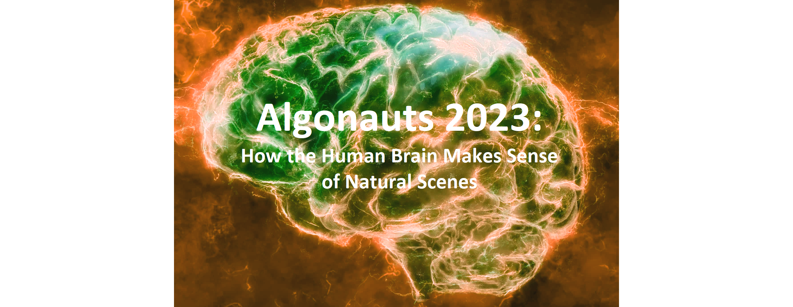

# **The Algonauts Project 2023 Challenge - devkit tutorial**

You can also run this tutorial on [Google Colab][colab]!

The quest to understand the nature of human intelligence and engineer more advanced forms of artificial intelligence are becoming increasingly intertwined. The Algonauts Project brings biological and machine intelligence researchers together on a common platform to exchange ideas and advance both fields. The 2023 challenge focuses on explaining neural visual responses to complex naturalistic scenes.

The Challenge is based on the [Natural Scenes Dataset][nsd] (NSD), a massive dataset of 7T fMRI responses to images of natural scenes coming from the [COCO dataset][coco]. The goal of the Challenge is to promote the development of cutting-edge encoding models which accurately predict (i.e., encode) the fMRI responses to visual input. You can read more about the Challenge in the [website][web] and [paper][paper].

Here we provide the development kit tutorial of the Challenge (`algonauts_2023_challenge_tutorial.ipynb`) where you will learn how to:
* Load and visualize the Challenge fMRI data, functionally different areas of the visual cortex called regions-of-interest (ROIs), and the stimulus images.
* Build [linearizing encoding models][encoding] using a pretrained [AlexNet][alexnet] architecture, evaluate them and visualize the resulting prediction accuracy (i.e., encoding accuracy).
* Prepare the predicted brain responses to the test images in the right format for submission to the Challenge leaderboard.

Please watch [this video][!!!!!!!!!!!!! link !!!!!!!!!!!!!] for an introduction to the Algonauts Project 2023 Challenge and a walkthrough of this development kit tutorial.

Should you experience problems with the code, please get in touch with Ale (alessandro.gifford@gmail.com).

[nsd]: https://doi.org/10.1038/s41593-021-00962-x
[coco]: https://cocodataset.org/#home
[web]: http://algonauts.csail.mit.edu
[paper]: https://arxiv.org/abs/2301.03198
[encoding]: https://www.sciencedirect.com/science/article/pii/S1053811910010657
[alexnet]: https://arxiv.org/abs/1404.5997
[colab]: https://colab.research.google.com/drive/1bLJGP3bAo_hAOwZPHpiSHKlt97X9xsUw?usp=share_link

## References

[Challenge Website][website]

[Challenge Paper][paper]

[Challenge Data][data]

[Challenge DevKit Tutorial (Colab)][tutorial_colab]

[Challenge DevKit Tutorial (GitHub)][tutorial_github]

[Challenge Overview and Colab Tutorial Walkthrough Video][!!!!!!!!!!!!! link !!!!!!!!!!!!!]

[CodaLab Challenge Submission Page][codalab]

[CodaLab Submission Walkthrough Video][codalab_video]

[Natural Scenes Dataset (NSD)][nsd]

[COCO Dataset][coco]

[Adapt COCO Metadata to Cropped NSD Images][adapt_coco_meta]

[website]: http://algonauts.csail.mit.edu
[paper]: https://arxiv.org/abs/2301.03198
[data]: https://docs.google.com/forms/d/e/1FAIpQLSehZkqZOUNk18uTjRTuLj7UYmRGz-OkdsU25AyO3Wm6iAb0VA/viewform?usp=sf_link
[tutorial_colab]: https://colab.research.google.com/drive/1bLJGP3bAo_hAOwZPHpiSHKlt97X9xsUw?usp=share_link
[tutorial_github]: https://github.com/gifale95/algonauts_2023
[codalab]: https://codalab.lisn.upsaclay.fr/competitions/9304
[codalab_video]: https://www.youtube.com/watch?v=-Nu2DL-zL4U
[nsd]: https://naturalscenesdataset.org/
[coco]: https://cocodataset.org/#home
[adapt_coco_meta]: https://github.com/styvesg/nsd_gnet8x/blob/main/data_preparation.ipynb

## Citations

If you use the data provided for the Algonauts Project 2023 Challenge please cite the following papers:
1. Gifford AT, Lahner B, Saba-Sadiya S, Vilas MG, Lascelles A, Oliva A, Kay K, Roig G, Cichy RM. 2023. *The Algonauts Project 2023 Challenge: How the Human Brain Makes Sense of Natural Scenes*. arXiv preprint, arXiv:2301.03198. DOI: https://doi.org/10.48550/arXiv.2301.03198

2. Allen EJ, St-Yves G, Wu Y, Breedlove JL, Prince JS, Dowdle LT, Nau M, Caron B, Pestilli F, Charest I, Hutchinson JB, Naselaris T, Kay K. 2022. *A massive 7T fMRI dataset to bridge cognitive neuroscience and computational intelligence*. Nature Neuroscience, 25(1):116–126. DOI: https://doi.org/10.1038/s41593-021-00962-x
